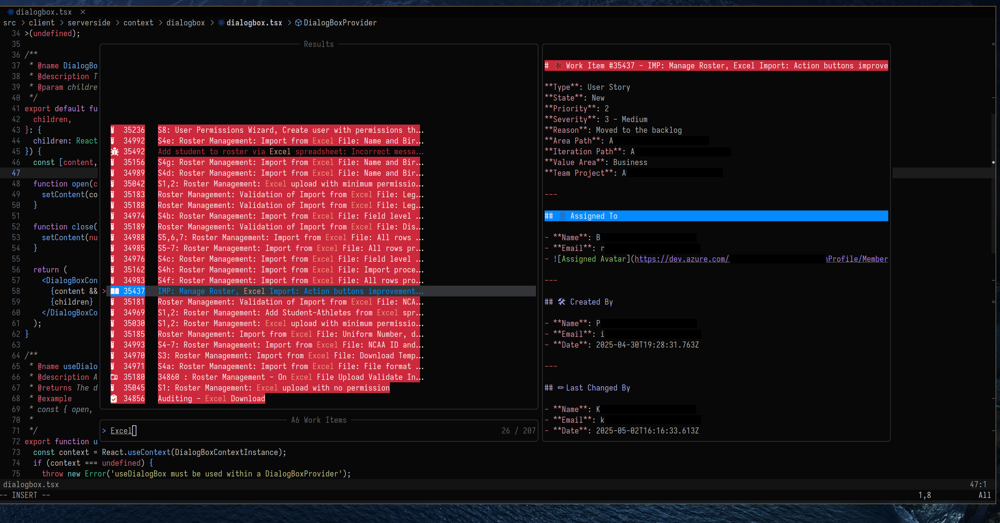
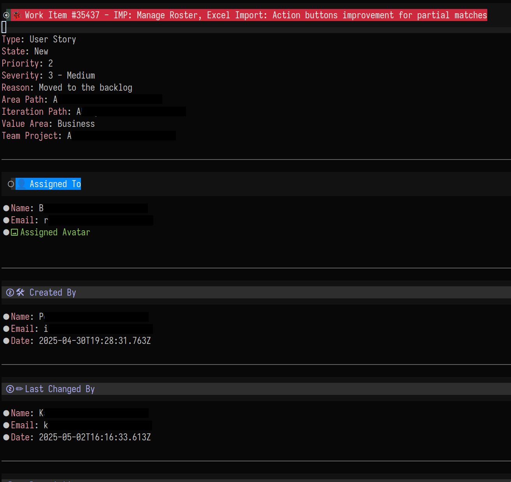

# Azure DevOps WorkItem neovim integration 
`azitems.nvim` is a Neovim plugin that allows you to interact with your Azure DevOps work items directly from your Neovim editor using your own Queries and WIQL.

<p float="left">
  
   
  
</p>

## Features
- View Azure DevOps work items in a telescope window.
- Query Azure DevOps work items using personal queries or WIQL.

## Planned
- [ ] Better error handling.
- [ ] Add support for WIQL queries.
- [ ] Add better methods for configuration: 
  - [ ] Set organization and project on the fly (without modifying your config).
  - [ ] Set the default query on the fly (and saving it to a state file).
  - [ ] Storing custom WIQL queries to be reused later.
- [ ] Adding support for creating work items.
- [ ] Adding support for mutating and updating work items.
- [ ] Interacting with Azure DevOps work items (e.g. adding comments, reactions, attachments.)
- [ ] Add internal features such as getting work item history, work item links, and work item attachments.

## Installation
Use your favorite plugin manager to install `azitems.nvim`. For example, using **Packer**
```lua
use({
  "identityofsine/azitems.nvim",
  requires = { "nvim-lua/plenary.nvim", "nvim-telescope/telescope.nvim" },
})
```

## Configuration

In order to use this plugin, you need to set up your Azure DevOps personal access token (PAT).

As of now this plugin requires you to set your organization and project in the configuration. 
```lua
require("azitems").setup({
   azure = {
       patToken = "...",
       organization = "identityofsineinc",
       project = "azitems",
   }
})
```

> If you want to set a default query (must be already saved in Azure DevOps) you can set the `query` field in the configuration.
```lua
require("azitems").setup({
   azure = {
       patToken = "...",
       organization = "identityofsineinc",
       project = "azitems",
       workitem = {
           query = {
               id = "uuid-string",
           }
       }
   }
})
```

## Usage

You can use the following commands to interact with Azure DevOps work items:

- `:AZWorkItems` - Use the current query to get work items from Azure DevOps. 
- `:AZQueries` - Get a list of queries you can use to get work items from Azure DevOps.
- `:AZClearCache` - Clear the cache of work items. Beware, this will remove all work items from the cache and significantly slow down the next query.

### Caching

The plugin caches the work items in a local file for 5 minutes by default, so you don't have to clear the cache every time you want to get work items. This timer is configurable in the setup function. 
```lua 
require("azitems").setup({
    api = {
    cache = {
      enabled = true,
      refreshTime = 300, -- 5 minutes
    },
   azure = {
       patToken = "...",
       organization = "identityofsineinc",
       project = "azitems",
   }
})
```
You can either disable the cache by setting `enabled` to `false` or set the refresh time to a lower value.


## Contributing
This project is open source and very young so feel free to contribute. 
